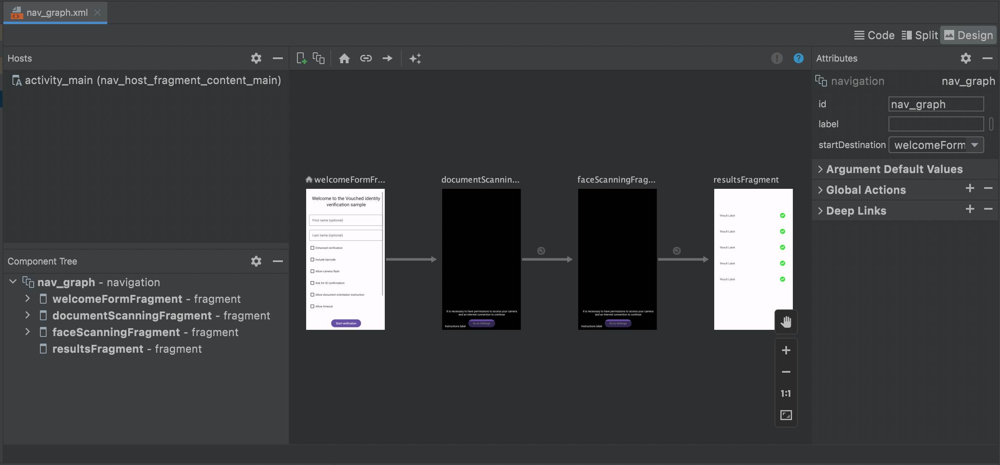

# Vouched Android Example

## Features in the Example

**1st Screen** - Welcome Form: In this screen we can set some configuration parameters for the SDK and optionally the name of the person who will go through the verification flow.

**2st Screen** - ID Detection: In this screen, the verification flow will start using the SDK to scan the user's ID, taking into account the parameters configured on the previous screen.

**3nd Screen** - Face Detection: In this screen the SDK is used to detect and obtain a photo of the user's face

**4th Screen** - ID Verification Results: The results of the verification flow are obtained and displayed, (data obtained from the ID, facial matches found, etc.)

When you finish, Vouched has performed the following features to verify your identity

- ID Card and Passport Detection
- Face Detection (with liveness)
- ID Verification
- Name Verification

## Getting Started

### IDE

We suggest to use [Android Studio](https://developer.android.com/studio) to run and modify the Example. Switch to the [Project View](https://developer.android.com/studio/projects#ProjectView) in order to view all the files associated with the project.

### Environment

1. If necessary, navigate to your Vouched Dashboard and create a [Public Key](https://docs.vouched.id/#section/Dashboard/Manage-keys).
2. Create gradle.properties for your app module

```
echo "API_KEY=\"\"" > ./examplekt/gradle.properties
```

4. Expose the key in your gradle app module properties

```
API_KEY="<PUBLIC_KEY>"
```

note: `"` is required for strings

### Build

Use Android Studio Gradle Plugin to build broject

### Run

Unfortunately, cameras are not supported in simulators so the best way to run the example is on a real device. Once your device is plugged in, run the Example through Android Studio

### Ktlint (taking care of the kotlin code style)

Ktlint has been integrated via gradle to ensure good code style.

You can use `./gradlew ktlintCheck` to check linting errors in kotlin code or you can run `./gradlew ktlintFormat` to in addition to checking try to automatically fix linting errors in kotlin code.

### Single Activity App

For now this application has a single Activity ([MainActivity](src/main/java/id/vouched/android/kt/example/MainActivity.kt)) that hosts a [navigation graph](https://developer.android.com/guide/navigation/navigation-getting-started#create-nav-graph) with multiple Fragments, you can see the navigation flow of the app visually by viewing the [nav_graph.xml](src/main/res/navigation/nav_graph.xml) file with Android Studio.


